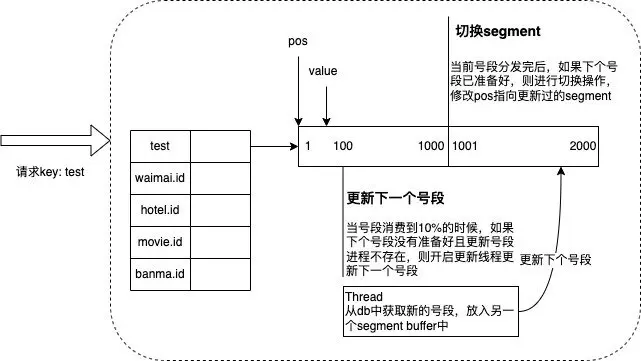

id生成服务

标识生成服务，可用于分布式环境的标识生成服务，本服务可以多实例部署。

要求
1. 全局唯一: 必须保证生成的 ID 是全局性唯一的；
2. 趋势递增: 生成的 ID 需要按照某种规则有序，便于数据库的写入和排序操作；
3. 单调递增: 后生成的标识大于前面生成的标识
3. 可用性: 需要保证高并发下的可用性。
4. 自主性: 分布式环境下不依赖中心认证即可自行生成 ID；
5. 安全性: 不暴露系统和业务的信息。在一些业务场景下，需要 ID 无规则或者不规则;

标识组成
1. 时间信息，从当前时间中根据模板获取数据段。

号段模式

批量获取标识，业务应用使用后临近剩余数量时生成新的号段，使用双标识缓冲区方式保存。在活动缓冲区使用量达到限定值时在备缓冲区放置新的号段。

号段分配器

数据结构
1. 最大序列
2. 步长
3. 版本号

分配步骤
1. 服务端按照KEY存储当前分配的最大值
2. 获取是

序列回绕，当序列递增到最大值时恢复为起始值重新开始。在使用中按照业务场景同一时间段中不能耗尽序列值。当序列发生回绕时分配器返回已回绕（backward）。

操作接口
1. 客户端注册标识，客户端使用应用名、规则(前缀、步长、阈值、初始值)进行注册。注册成功后返回标识

标识生成规则，时间段、数字序列

1. 前缀: 使用模板方式生成，生成参数包括当前时间，时间戳。
2. 位数: 表示数据序列包含的位数，如4位表示序列
3. 初始值：序列初始值，序列到达最大值时返回到初始值。

标识生成统一包含时间信息，由于在分布式环境中各应用节点时间可能并不同步，可能造成应用节点生成重复。

1. 应用端获取片段时记录当前时间(T1)
2. 请求服务端分配片段
3. 服务端记录报文到达时间(T2)
4. 服务端处理完成后记录离开时间(T3)
5. 应用端接收到响应时，记录时间(T4)

时间周期延时

1. Delay = ( T4 - T1 ) - ( T3 - T2 )
2. Offset = (( T2- T1 ) + ( T3 – T4 )) / 2

应用端使用延时和偏移计算当前时间

标识服务服务器多活

微信序列号生成方案

微信序列号跟用户 uin 绑定，具有以下性质：递增的 64 位整形；使用每个用户独立的 64 位 sequence 的体系，而不是用一个全局的 64 位（或更高位） sequence ，很大原因是全局唯一的 sequence 会有非常严重的申请互斥问题，不容易去实现一个高性能高可靠的架构。其实现方式包含如下两个关键点：

1）步进式持久化：增加一个缓存中间层，内存中缓存最近一个分配出现的 sequence：cur_seq，以及分配上限：max_seq；分配 sequence 时，将 cur_seq++，与分配上限 max_seq 比较，如果 cur_seq > max_seq，将分配上限提升一个步长 max_seq += step，并持久化 max_seq；重启时，读出持久化的 max_seq，赋值给 cur_seq。此种处理方式可以降低持久化的硬盘 IO 次数，可以系统的整体吞吐量。

2）分号段共享存储：引入号段 section 的概念，uin 相邻的一段用户属于一个号段，共享一个 max_seq。该处理方式可以大幅减少 max_seq 数据的大小，同时可以进一步地降低 IO 次数。

二进制模式
按照二进制模式处理序列号生成，各数据段按照各自的位长度组装

十进制模式

缺陷

当发生序列回绕时，不同的时间序列有不同的处理。如时间序列精度为日，那么在发生回绕时认为此时的回绕不能发生。如果应用在当日内被重启，并且发生了回绕，当前机制无法检测此问题。
序列记录可以依赖于外部存储，如Redis，DB等。当外部存储失效时序列可能会发生冲突。此时当时间段没有前进时可能发生重复。一般认为DB为不失效存储。

需要烦精确的选择时间段和序列的相对关系，一般情况下

ID分配器工作流程

初始化
1. 创建生成器
2. 创建外部存储
3. 指定生成器生成规则，机器码长度，序列长度，序列化格式。
4. 创建双缓存，使用外部存储分配数据段。

标识分配
1. 向序列缓冲器获取下一序列
2. 向时间段分配器获取下一时间戳（传入是否回旋）
4. 由标识组装器获取

格式化器

    十进制格式化，时间段格式串
    二进制格式化，起始时间，时间精度